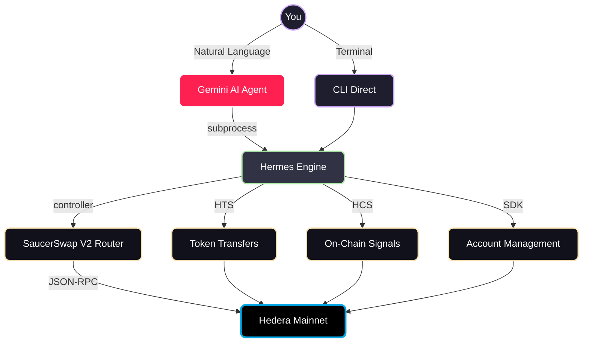

# 🚀 Hermes

**Open-source Hedera DeFi toolkit built for a Gemini AI Agent to drive — via CLI tool use, not MCP. Fully built. Ready to go.**

[](https://hedera.com)
[](https://saucerswap.finance)
[](https://gemini.google.com)
[](https://python.org)
[](LICENSE)

Built by Rauneet — [github.com/raunet234](https://github.com/raunet234)

---

## 💡 What is Hermes?

The [Hedera Agent Kit](https://github.com/hashgraph/hedera-agent-kit) gives developers incredible building blocks — swaps, transfers, token operations. **What it doesn't give you is an agent system to drive them.** That's what we built.

Hermes is the **connective tissue** between a Gemini AI Agent and the Hedera hashgraph. It collapses the exchange, the wallet, and the portfolio tracker into one local CLI tool that an AI agent drives through **CLI tool use — not MCP**. Your agent doesn't write swap code. It calls fixed tools every time. One valid execution path per operation.

| | Hedera Agent Kit | Hermes |
|---|---|---|
| **What** | Developer toolkit / library | Full-stack agent-driven application |
| **Agent integration** | You build it | Pre-configured Gemini AI Agent specialist |
| **SaucerSwap** | API-dependent | Direct smart contract calls (no API) |
| **Governance** | None | Read-only config: per-swap limits, daily caps, slippage ceilings |
| **Key security** | Framework-dependent | XOR-obfuscated, agent-sandboxed, whitelisted transfers |
| **Runs on** | Your infrastructure | Your machine — local edge compute |

> No browser wallet. No exchange login. No click fatigue. No multi-app juggling.
> **One local tool. 30+ commands. Direct to smart contracts.**

We consume the middleware — starting with HashPack and SaucerSwap. Built and tested exclusively on **Hedera mainnet with real tokens**.

---

## ⚡ Quick Start

### Option A: From your Gemini AI Agent

We're heading to a **multi-agent universe**. The Hermes skill is a support tool that provides agentic control of the application (installed in Option B). Your primary Gemini AI Agent can clone this repo, install the app, and spin up a **dedicated trading agent** with the Hermes skill package.

1. Ask your agent to `git clone` this repo and install the application locally
2. Have it spin up a dedicated trading agent using the Hermes skill
3. **Set up Telegram** — create your own bot to chat directly with your new agent (Gemini AI Agent also supports Discord and other platforms)

### Option B: Manual Install (Mac/Linux)

> ⚠️ **Best to run locally** — don't pass crypto keys through AI LLM chat APIs (unsafe — keys could end up in model training data). New key protection features coming soon. For now, treat as live network "experimental."

```bash
git clone https://github.com/raunet234/hermes.git
cd hermes
./launch.sh init        # Guided wizard: key setup, token associations
./launch.sh help        # See all 30+ available commands
./launch.sh balance     # Check your portfolio
./launch.sh swap 10 USDC for HBAR          # Execute a real swap
```

`./launch.sh` is a zero-dependency bash launcher — installs `uv`, validates `.env`, dispatches to the CLI engine. Keys entered locally through the wizard — they never travel through any API.

---

## 🏗️ Architecture



### Components

| Component | Role |
|-----------|------|
| 🔧 **CLI Engine** | 30+ deterministic commands. Controller → router → executor pipeline. |
| 🔀 **SaucerSwap V2 Router** | Custom, open-source multi-hop path finding. Direct smart contract calls via JSON-RPC. |
| 🛡️ **Governance Engine** | Per-swap max, daily max, slippage cap, gas reserve. User-configurable, agent-immutable. |
| 🤖 **Gemini AI Agent** | Reads SKILL.md, interprets natural language, executes CLI via subprocesses. Light key protection — full sandbox planned. |
| 📊 **Power Law Rebalancer** | Autonomous daemon for local portfolio rebalancing. Proof of concept while awaiting Hedera Schedule Service. |
| 📡 **HCS Publisher** | (1) Crowd-sourced bug/telemetry logging for self-healing. (2) Trading signal broadcast for potential monetization. |
| 🧠 **Training Pipeline** | Records CLI commands + responses as instruction pairs for future LLM fine-tuning. |

### Interfaces

| Interface | Speed | Best for |
|-----------|-------|----------|
| 🤖 **Gemini AI Agent** (Telegram) | ~2-5s | Drives the CLI for you — no commands to remember, no multi-step waits |
| 💻 **Terminal CLI** | Instant | Scripting, automation, direct control |
| 📊 **Dashboard** | Real-time | Visual monitoring |

---

## 🔗 Hedera Integration

Direct to Hedera — no middleware:

| Service | Usage |
|---------|-------|
| **SaucerSwap V2** | Direct router/quoter calls via JSON-RPC. Multi-hop path finding. |
| **HTS** | Token associations, transfers, approvals via HTS Precompile. |
| **HCS** | Signal broadcast, bug telemetry, HCS-10 agent-to-agent messaging. |
| **Mirror Node** | Real-time balances, transaction history, key lookups. |
| **Accounts** | Multi-account management, creation via Hiero SDK, ECDSA signing. |
| **Staking** | HBAR staking/unstaking to consensus nodes. |

---

## 🎯 Features at a Glance

- **🔄 Token Swaps** — Natural language ("swap 10 USDC for HBAR") → SaucerSwap V2 smart contracts
- **💰 Portfolio Management** — Real-time balances, USD values, transaction history, NFT viewer
- **📤 Self-Custody Transfers** — Whitelisted destinations only. EVM addresses blocked.
- **🤖 Autonomous Rebalancing** — Power Law daemon auto-rebalances BTC allocation on thresholds
- **📡 On-Chain Signals** — Daily HCS heartbeat. Structured JSON. Anyone can subscribe.
- **🛡️ Governance & Safety** — One config file. Per-swap limits, slippage caps, gas reserves. Agent can't modify.
- **🧠 Training Data** — Every command generates fine-tuning data for future AI models

---

## 🔒 Security Model

> **The golden rule: the AI agent never sees your keys.**

- 🔐 Keys stored locally in `.env`, encrypted in memory, decrypted only at signing, then immediately cleared
- 🧠 Agent predicts *intent*. Deterministic CLI handles the *cryptography*.
- 📋 Wallet whitelists enforce all transfers — no exceptions
- 🛡️ Governance is read-only to the agent
- ⚡ We never simulate — every transaction is real

---

## 📚 Resources

> **Milan AI Week Hackathon 2026 — AI Agent Olympics**

| Resource | Link |
|----------|------|
| 🎥 Demo Video | [YouTube](https://www.youtube.com/watch?v=OElX33KViGo) |
| 📡 HCS Signal Topic | `0.0.10371598` |

---

## License

MIT

---

*Built with real money. Real transactions. Real learnings.* 🚀
